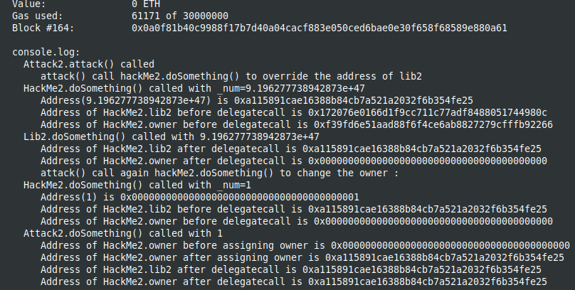

Two Study cases of delegatecall hack, from Solidity by example site [Solidity by Example, delegatecall](https://solidity-by-example.org/hacks/delegatecall/)

I used brownie with hardhat in order to deploy and use the console.log features.
You should start the hardhat node in another terminal and folder (```hh node```), then, in a terminal :
```
brownie compile
brownie run scripts/deployDelegateCall.py
brownie run scripts/deployDelegateCall2.py
```
In the first file, DelegateCall.sol, is using the assigment of owner in Lib.pwn() to change to override the first member "address public owner" of HackMe

From the Solidity documentation:
"The fallback function is executed on a call to the contract if none of the other functions match the given function signature, or if no data was supplied at all and there is no receive Ether function."

In this case, the fallback was called because there is no function hackMe.pwn() as specified in hackMe.call(abi.encodeWithSignature("pwn()"))


Uncommenting the pwn() function in HackMe will avoid triggering the fallback, but the call to delegatecall will still override the owner of the contract by the assigment in lib.pwn()


In the second file, DelegateCall2.sol, a different utilisation of delegatecall,
overriding variables in HackMe2 contract


